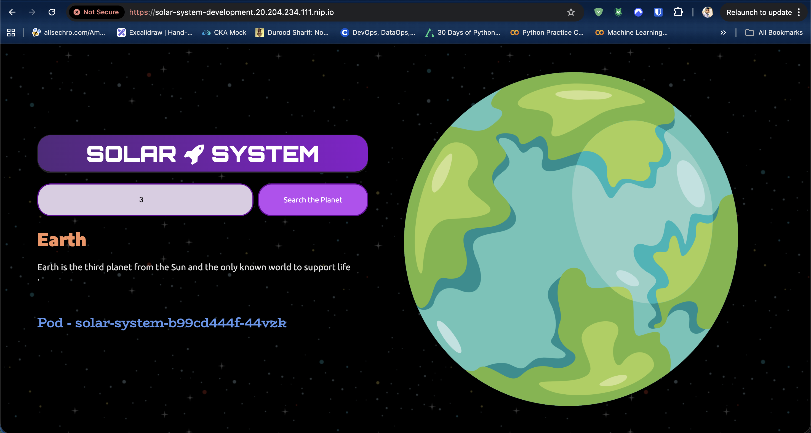
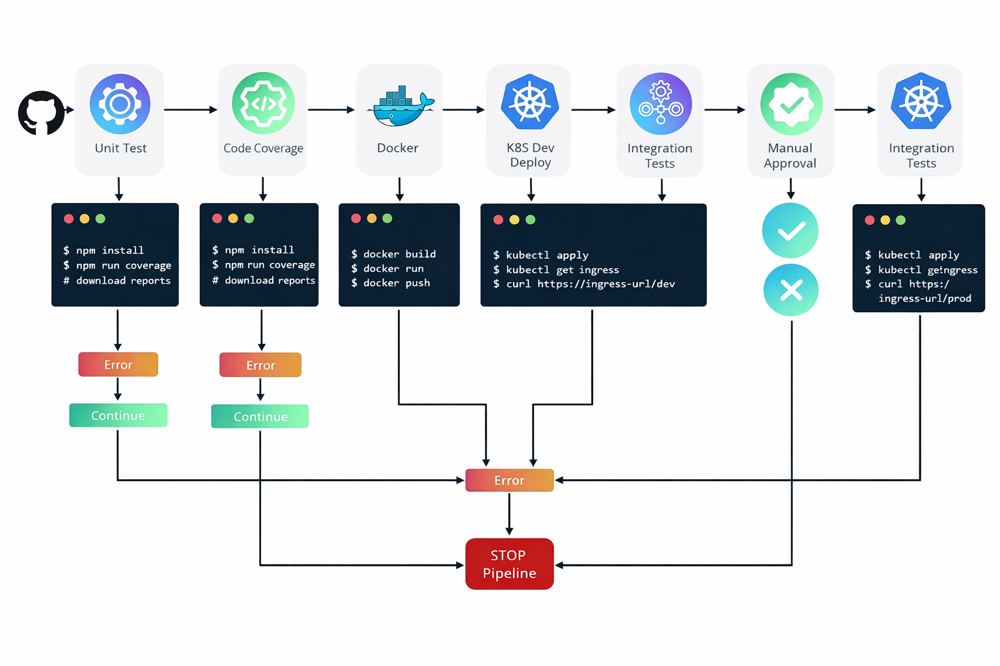

# Solar System CI/CD on GitHub Actions and AKS

This project is a Node.js and MongoDB web application that displays Solar System data in a simple browser UI. A user can search for a planet by ID, view its details, and access health endpoints that are used during container and Kubernetes validation.

The repository also includes a full CI/CD pipeline with GitHub Actions, Docker, and Kubernetes. The workflow runs tests, builds and pushes a Docker image, deploys to a development namespace on AKS, tests the deployed app through ingress, and then pauses for manual approval before deploying to production.

## Website Preview



## GitHub Actions Architecture



## Application Overview

- Backend: Node.js with Express
- Database: MongoDB
- Frontend: Static HTML, CSS, and JavaScript served by Express
- Containerization: Docker
- Orchestration: Kubernetes on Azure Kubernetes Service
- CI/CD: GitHub Actions

Main application endpoints:

- `/` serves the website
- `/planet` returns planet data from MongoDB
- `/live` is used for liveness checks
- `/ready` is used for readiness checks
- `/os` shows pod and environment details

## Project Structure

```text
.
|-- .github/workflows/solar-system.yml
|-- Dockerfile
|-- app.js
|-- app-test.js
|-- kubernetes/
|   |-- development/
|   `-- production/
|-- images/
`-- package.json
```

## Run Locally

### Prerequisites

- Node.js 18 or later
- npm
- MongoDB connection details

### Install dependencies

```bash
npm install
```

### Set environment variables

The app can run against a local MongoDB instance or a remote MongoDB cluster.

Example for a local database:

```bash
export MONGO_URI="mongodb://127.0.0.1:27017/solar-system"
unset MONGO_USERNAME
unset MONGO_PASSWORD
```

Example for a remote MongoDB database:

```bash
export MONGO_URI="<your-mongodb-uri>"
export MONGO_USERNAME="<your-mongodb-username>"
export MONGO_PASSWORD="<your-mongodb-password>"
```

### Start the application

```bash
npm start
```

The app will be available at:

```text
http://localhost:3000
```

### Run tests locally

Unit tests:

```bash
npm test
```

Coverage:

```bash
npm run coverage
```

## Docker

Build the image locally:

```bash
docker build -t solar-system:local .
```

Run the container locally:

```bash
docker run --rm -p 3000:3000 \
  -e MONGO_URI="$MONGO_URI" \
  -e MONGO_USERNAME="$MONGO_USERNAME" \
  -e MONGO_PASSWORD="$MONGO_PASSWORD" \
  solar-system:local
```

## Kubernetes Manifests

The repository contains two Kubernetes environments:

- `kubernetes/development`
- `kubernetes/production`

The manifests use token placeholders such as `_{_NAMESPACE_}_`, `_{_REPLICAS_}_`, `_{_K8S_IMAGE_}_`, and `_{_INGRESS_IP_}_`. These are replaced inside the GitHub Actions workflow before the manifests are applied to AKS.

## GitHub Actions Workflow

The workflow file is:

[`/.github/workflows/solar-system.yml`](.github/workflows/solar-system.yml)

### What the workflow does

1. Runs unit tests.
2. Runs code coverage.
3. Builds the Docker image.
4. Starts the container and validates the `/live` endpoint.
5. Pushes the image to Docker Hub.
6. Deploys the application to the `development` namespace in AKS.
7. Installs or updates the `ingress-nginx` controller if needed.
8. Replaces manifest tokens and applies the development manifests.
9. Tests the development deployment through ingress.
10. Waits for manual approval before production deployment.
11. Deploys the same image to the `production` namespace.
12. Tests the production deployment.

### Manual approval for production

The production job targets the GitHub Actions `production` environment. If that environment has required reviewers configured in repository settings, GitHub pauses the production job until an approver allows it to continue.

### Required GitHub secrets and variables

Repository secrets:

- `DOCKERHUB_PASSWORD`
- `KUBECONFIG`
- `MONGO_PASSWORD`

Repository variables:

- `DOCKERHUB_USERNAME`
- `MONGO_URI`
- `MONGO_USERNAME`

Optional environment-specific values can also be moved into GitHub Environments if you want separate development and production configuration.

## AKS Deployment Flow

During deployment the workflow:

- authenticates to AKS using `KUBECONFIG`
- installs `ingress-nginx`
- fetches the ingress controller external IP
- replaces manifest placeholders
- creates the target namespace
- creates the `mongo-db-creds` secret in Kubernetes
- applies the manifests
- verifies rollout status
- runs an HTTP test on `/live`

## Notes

- The development and production app URLs use `nip.io` hostnames generated from the ingress controller public IP.
- The first deployment can take a little longer while the Azure load balancer and ingress controller become ready.
- If you want stricter separation, use different secrets and variables for development and production.

